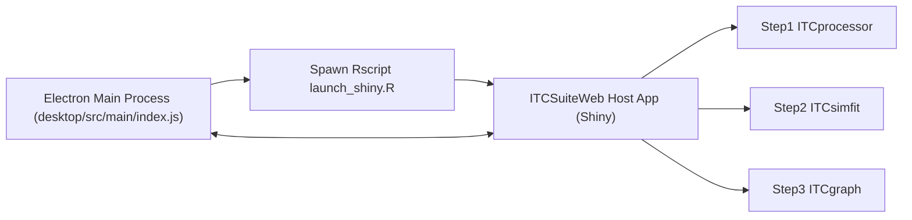
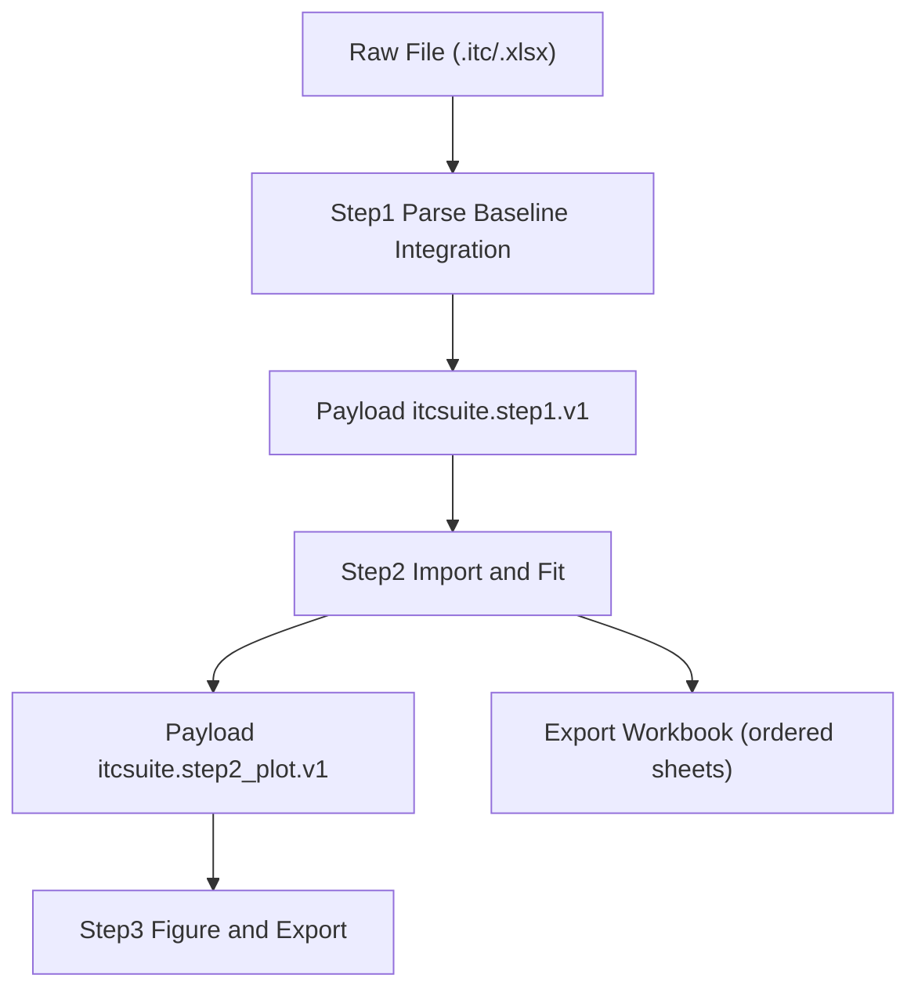
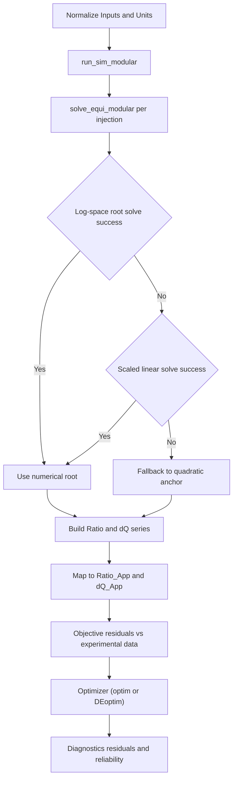

# ITCSuite App 技术设计文档（中英双语）

> 品牌说明（Brand Note）  
> 本文档中的 `ITCSuite` 指 `ViaBind` 软件系列中的 ITC 专业套件（`ViaBind_ITCSuite`）。  
> 为保持技术文档与代码命名一致，正文仍以 `ITCSuite` 作为主要工程名称。

## 0. 文档说明（Document Notes）

- 文档目标（Goal）  
  为科研用户提供一份可追溯到代码实现的技术说明，覆盖 ITCSuite 全链路：`desktop + ITCSuiteWeb + Step1/Step2/Step3`。
- 读者假设（Audience Assumption）  
  读者具备 ITC 实验基础，但不预设熟悉 R/Shiny/Electron 内部实现。
- 文档范围（In Scope）  
  核心模块原理、实现路径、数据契约、导入导出、质量保障。
- 非目标（Out of Scope）  
  商业宣传、UI 文案细节、代码改造提案。
- 声明（Disclaimer）  
  本文档由AI自动生成，仅供参考。

---

## 1. 产品与系统定位（Product Positioning）

ITCSuite 是一个三步式（three-step）ITC 分析与出图工作流：

1. Step1（`ITCprocessor`）  
   `.itc` 原始数据解析、基线校正（baseline correction）、积分（integration）。
2. Step2（`ITCsimfit`）  
   结合模型模拟与参数拟合（simulation and fitting）。
3. Step3（`ITCgraph`）  
   出版级双 Panel 图（publication-quality figure）与导出。

与传统“固定单模型拟合”路线相比，ITCSuite 的 Step2 采用“路径组合建模（path-combination modeling）”思路：  
用户通过勾选反应路径组合快速构建不同模型形态，在统一框架内完成拟合与比较。

系统运行形态是 Electron 桌面壳 + 本地 Shiny 后端（local Shiny backend）：

- Electron 主进程负责启动、监控与恢复后端。
- `ITCSuiteWeb` 作为宿主（host app）统一挂载三个 legacy 模块，完成跨步数据桥接（bridge）。

---

## 2. 全局架构（Global Architecture）

### 2.1 组件边界（Component Boundaries）

- `desktop`：Electron 主进程、IPC、后端进程生命周期管理。
- `ITCSuiteWeb`：统一入口、导航、桥接总线、最近记录和恢复。
- `ITCprocessor`：Step1 数据预处理与积分。
- `ITCsimfit`：Step2 核心模拟与拟合。
- `ITCgraph`：Step3 出图与图形导出。

### 2.2 启动与进程关系（Startup & Process Topology）



### 2.3 关键实现入口（Code Entrypoints）

- Desktop 启动与恢复：`desktop/src/main/index.js`
- 后端启动脚本：`ITCSuiteWeb/scripts/launch_shiny.R`
- 宿主入口：`ITCSuiteWeb/app.R`

---

## 3. 核心数据与契约（Core Data Contracts）

### 3.1 Desktop 启动握手协议（Startup Handshake Protocol）

后端脚本以标准输出协议通知桌面壳状态：

- Ready：`ITCSUITE_READY {"port":...,"host":...,"ts":...}`
- Error：`ITCSUITE_ERROR {"message":...,"ts":...}`

实现来源：

- `ITCSuiteWeb/scripts/launch_shiny.R`
- `desktop/src/main/index.js` 中 `READY_PREFIX` / `ERROR_PREFIX` 解析逻辑

### 3.2 Step1 -> Step2 桥接契约（Bridge Contract）

校验器：`sanitize_step1_payload()` in `ITCSuiteWeb/R/bridge_contract.R`

- 顶层 schema：`schema_version = itcsuite.step1.v1`
- bundle schema：`bundle.schema_version = itcsuite.bundle.v1`
- 强约束字段：
  - `created_at`（非空）
  - `token`（可转为有限 numeric）
  - `bundle.integration`（data.frame，且包含 `Ratio_App` 与 `heat_cal_mol` 或 `Heat_ucal`）

### 3.3 Step2 -> Step3 桥接契约（Bridge Contract）

校验器：`sanitize_step2_plot_payload()` in `ITCSuiteWeb/R/bridge_contract.R`

- schema：`schema_version = itcsuite.step2_plot.v1`
- 来源枚举：`source in {bridge, file, sim_to_exp}`
- 最小 body：必须至少存在一类数据体（如 `sheets`、`integration_rev`、`simulation`、`fit_params`）。

Step3 侧由 `ITCgraph/R/bridge_plot_helpers.R` 做 source label 解析与 payload frame 提取。

### 3.4 跨步数据流（Cross-Step Data Flow）



### 3.5 首页最近记录持久化 schema（Recent Store Schema）

`ITCSuiteWeb/R/home_recent_store.R` 使用：

- `schema_version = itcsuite.home_recent.v1`
- 状态结构关键字段：
  - `next_seq`
  - `import_records`
  - `max_records`
  - `updated_at`

最近导入功能说明（Recent Imports Behavior）：

- 首页维护“最近导入”列表，优先服务当前会话（session）中的重复调用场景。
- 记录类型覆盖：
  - `itc`（原始 ITC 源文件）
  - `processed_xlsx`
  - `fitted_xlsx`
- 通过恢复动作（Restore & Open）可快速回到对应步骤（Step1/Step2）继续分析。
- 在桌面运行中，最近记录还会写入本地状态文件 `state/home_recent_imports_v1.rds`，增强跨会话连续性。

补充说明（Host Runtime State）：

- 宿主应用运行时以 `values$bundle` 维护跨步共享状态（文档名常记为 `itc_bundle_v1`），桥接时按 `itcsuite.bundle.v1` 结构落地。

---

## 4. Step1 模块：Parsing / Baseline / Integration

### 4.1 底层原理（Underlying Principles）

1. 文件解析（Parsing）  
   `read_itc()` 按行扫描 `.itc`：  
   - `$`/`#` 区提取实验参数（浓度、体积、温度等）  
   - `@` 行定位注射事件（injection indices, times, volumes）  
   - 数值行提取 `Time` 与 `Power`

2. 分段样条基线（Segmented Spline Baseline）  
   `SegmentedBaseline()` 通过每针前锚点（anchor）构造样条曲线，得到 baseline；点位不足时退化为线性模型。

3. 梯形积分（Trapezoidal Integration）  
   `integrate_peaks()` 逐针对校正后功率积分，支持 `start_offset` 与 `integration_window` 控制积分区间。

### 4.2 实现映射（Implementation Mapping）

- 入口：`ITCprocessor/app.R`
- 解析：`ITCprocessor/R/data_parser.R`
- 基线：`ITCprocessor/R/baseline.R`
- 积分：`ITCprocessor/R/integration.R`

### 4.3 关键失败与回退（Failure/Fallback）

- 注射信息缺失时做最小回退（例如默认首针索引）。
- 锚点不足时使用线性拟合作为基线回退。
- 积分边界冲突时当前针热量置 0，保持流程可继续。

---

## 5. Step2 模块：Simulation / Fitting Engine

### 5.1 底层原理（Underlying Principles）

1. 路径组合建模（Path-Combination Modeling）  
   Step2 并非仅依赖单一固定模型，而是基于路径集合组合出模型结构：  
   - 基础路径：`rxn_M`（始终参与）  
   - 可选路径：`rxn_D` / `rxn_T` / `rxn_B` / `rxn_F` / `rxn_U`  
   该机制使模型结构更贴近不同体系的物理实际，并支持快速切换比较。

2. 平衡求解器（Equilibrium Solver）  
   `solve_equi_modular()` 使用“解析锚点 + 数值求解”混合策略：
   - 先用 1:1 模型二次方程得到锚点解（anchor guess）。
   - 复杂路径下先走 log-space `multiroot`。
   - 失败后尝试线性缩放求解。
   - 仍失败则回退锚点并打 `is_fallback=1`。

3. 滴定模拟（Titration Simulation）  
   `run_sim_modular()` 逐针更新浓度并求平衡，输出热量和组分比例，包含 `Fallback` 标记。

4. 表观量修正（Apparent Space Mapping）  
   `calculate_simulation()` 执行：
   - 浓度修正：`H_cell_0`, `G_syringe` 乘以 `fH/fG` 并单位换算
   - 比值回算：`Ratio_App = Ratio_True * (fH/fG)`
   - 热量映射：`dQ_App = dQ_True * fG + Offset`

5. 拟合目标函数与双优化器（Objective + Dual Optimizers）  
   `R/server/body/runtime_core/02_simulation_fitting.R` 中以实验热量与模拟热量残差构造损失函数，支持：
   - 局部收敛：`optim`（梯度/局部优化路线）
   - 全局搜索：`DEoptim`（Differential Evolution，可用于跳出 local minima）
   - 可选加权/鲁棒损失，适配不同噪声特征（该功能暂时未在UI中开放）

### 5.2 学术输出与可调自由度（Publication-Oriented Output with User Freedom）

Step2 的设计目标不是“黑箱自动拟合”，而是“可解释的可调拟合”：

- 输出形态贴近学术发表常见需求（参数、曲线、残差、可靠性信息可联动呈现）。
- 用户可在路径组合、参数边界、拟合区间和拟合策略间调整，以适配不同实验体系。
- 保持“可调整”与“可复现”的平衡：调整过程可通过结构化导出与测试回归进行复核。

### 5.3 算法流程图（Solver & Fitting Pipeline）



### 5.4 实现映射（Implementation Mapping）

- 核心求解/模拟：`ITCsimfit/R/core_logic.R`
- 修正与包装：`ITCsimfit/R/fitting.R`
- 运行时组装：`ITCsimfit/R/server/server_main.R`
- 运行核心：`ITCsimfit/R/server/body/runtime_core/01_bridge_state_inputs.R`  
  `ITCsimfit/R/server/body/runtime_core/02_simulation_fitting.R`  
  `ITCsimfit/R/server/body/runtime_core/03_plots_diagnostics.R`

---

## 6. Step3 模块：Publication Plotting

### 6.1 底层原理（Underlying Principles）

1. 双 Panel 图范式（Dual-Panel Figure Pattern）  
   - 上 Panel：Thermogram（功率-时间）
   - 下 Panel：Isotherm（热量-比值）
   通过 `ggplot2 + patchwork` 组合，强调文献风格一致性。

2. 单位转换（Unit Conversion）  
   由 `energy_units.R` 提供标签映射，支持 `cal` 与 `J` 系标签和转换语义。

3. 桥接数据恢复（Bridge-Based Reconstruction）  
   `bridge_plot_helpers.R` 从 Step2 payload 提取 `integration`/`simulation`/`fit_params` 并恢复 source 标签、修正参数。

### 6.2 实现映射（Implementation Mapping）

- Step3 入口：`ITCgraph/app.R`
- 绘图核心：`ITCgraph/R/plotting.R`
- 桥接助手：`ITCgraph/R/bridge_plot_helpers.R`
- 单位标签：`ITCgraph/R/energy_units.R`

---

## 7. 宿主编排层（ITCSuiteWeb Host）

### 7.1 为什么宿主化（Why Host Legacy Apps）

`ITCSuiteWeb` 将三个独立 Shiny 子应用统一承载，得到：

- 一致导航与用户会话（single navigation/session）
- 跨步 payload 流转（bridge channel）
- 首页恢复、最近导入导出记录、桌面能力接入

### 7.2 关键实现机制（Key Mechanisms）

1. Legacy 加载与隔离（Legacy Loading & Isolation）  
   `load_legacy_app()` 在独立环境中加载各 `app.R`，并固定 `server` 函数环境，降低跨模块符号污染风险。

2. 桥接总线（Bridge Bus）  
   `bridge_bus_server()` 创建 `step1_payload` 与 `step2_plot_payload` 两类 channel，统一经校验后写入。

3. 首页恢复（Home Restore）  
   `home_recent_helpers.R` + `home_recent_store.R` + `home_desktop_helpers.R` 提供类型识别、持久化、桌面文件选择交互。

4. 最近导入函数族（Recent Imports Function Family）  
   - 类型识别：`home_detect_import_type()`（识别 `itc`/`processed_xlsx`/`fitted_xlsx`）  
   - 记录写入：`add_recent_import()` / `add_recent_record()`  
   - 列表读取：`get_recent_imports()`  
   - 一键恢复：`restore_recent_record()`  
   - 持久化读写：`home_recent_store_load()` / `home_recent_store_save()`  
   这组函数共同保证“导入后可重复调用”的用户体验。

---

## 8. 桌面壳层（Desktop Integration）

### 8.1 BackendController 生命周期

`desktop/src/main/index.js` 中 `BackendController` 负责：

- 路径解析：repo/app/runtime
- 运行时选择：系统 `Rscript` 或 bundled runtime
- 启动命令拼装：调用 `launch_shiny.R`
- READY/ERROR 解析和状态转移

### 8.2 桌面能力（Desktop Capabilities）

- IPC 频道：`itcsuite:open-file`（`OPEN_FILE_CHANNEL`）
- 允许用途：`step1_import` / `step2_import` / `step3_import`
- 支持恢复策略：休眠恢复、渲染进程无响应恢复、失败加载恢复

### 8.3 容错原则（Fault Tolerance）

- 后端不可用时尽量重启后端或重载渲染器。
- 主流程以“可恢复”为目标，不将瞬时故障直接升级为不可逆退出。

---

## 9. 导入导出与可复现性（I/O & Reproducibility）

### 9.1 Step2 导出工作簿契约（Workbook Contract）

`export_bridge_order_sheets()` 定义导出 sheet 顺序（若存在）：

1. `power_original`
2. `meta`
3. `power_corrected`
4. `integration`
5. `meta_rev`
6. `integration_rev`
7. `simulation`
8. `fit_params`
9. `error_reliability`
10. `error_analysis`
11. `residuals`
12. `correlation_matrix`
13. `report`

该顺序确保 Step2/Step3 与回读流程对同一语义有稳定约定。

### 9.2 测试门禁（Testing Gate）

仓库顶层统一入口：

```bash
Rscript tests/run_all.R --strict
```

包含三类必过套件：

- `unit`
- `smoke`
- `golden`

Golden 回归用于固定关键输出列（如 `Ratio_App`, `heat_cal_mol`）的稳定性。

---

## 10. 质量保障与可维护性（Quality & Maintainability）

### 10.1 模块边界规则（Layering Rule）

`ITCsimfit/docs/phase2/module-boundaries.md` 约束依赖方向：

`Entrypoint -> Server Runtime -> Domain -> Infrastructure`

禁止反向依赖和隐式跨层耦合。

### 10.2 统一错误与日志接口（Error/Logging Interfaces）

`ITCsimfit/R/infrastructure/errors.R` 与 `ITCsimfit/R/infrastructure/logging.R` 提供统一语义，降低运行时诊断成本。

### 10.3 注释与契约化说明（Commenting Standard）

各模块已逐步采用结构化注释标签（如 `MODULE_HEADER`, `IO_CONTRACT`, `KEY_ALGO`），利于工程维护与文档反向映射。

---

## 11. 术语表与字段字典（Glossary & Field Dictionary）

### 11.1 术语表（Glossary）

| 中文术语 | English | 说明 |
|---|---|---|
| 宿主应用 | Host App | 承载多个 legacy 模块的统一 Shiny 入口 |
| 桥接载荷 | Bridge Payload | 步骤间传输的数据对象 |
| 表观比值 | Apparent Ratio (`Ratio_App`) | 面向用户与图形展示的比值空间 |
| 回退求解 | Fallback Solve | 数值求解失败时的保底策略 |
| 严格门禁 | Strict Gate | PR 必过测试组合 |

### 11.2 字段字典：Step1 Payload（`itcsuite.step1.v1`）

| 字段 | 类型 | 说明 |
|---|---|---|
| `schema_version` | string | 固定 `itcsuite.step1.v1` |
| `created_at` | string | 创建时间 |
| `token` | number | 跨步去重/时序标识 |
| `source` | string | 来源（默认 `Step1`） |
| `bundle` | list | 含 `meta` / `power_original` / `power_corrected` / `integration` |
| `bundle.schema_version` | string | 固定 `itcsuite.bundle.v1` |

### 11.3 字段字典：Step2 Plot Payload（`itcsuite.step2_plot.v1`）

| 字段 | 类型 | 说明 |
|---|---|---|
| `schema_version` | string | 固定 `itcsuite.step2_plot.v1` |
| `created_at` | string | 创建时间 |
| `token` | number | 跨步标识 |
| `source` | string | `bridge` / `file` / `sim_to_exp` |
| `source_label` | string | 显示给用户的来源名 |
| `sheets` | list | 导出表数据集合 |
| `integration_rev` | data.frame | 修订后积分数据 |
| `simulation` | data.frame | 模拟结果 |
| `fit_params` | data.frame | 拟合参数表 |

### 11.4 字段字典：Recent Store（`itcsuite.home_recent.v1`）

| 字段 | 类型 | 说明 |
|---|---|---|
| `schema_version` | string | 固定 `itcsuite.home_recent.v1` |
| `next_seq` | integer | 记录序号计数器 |
| `import_records` | list | 最近导入记录 |
| `max_records` | integer | 最大保留条数 |
| `updated_at` | string | 更新时间 |

### 11.5 合法 Step1 Payload 示例（Valid Example）

```json
{
  "schema_version": "itcsuite.step1.v1",
  "created_at": "2026-02-21T10:00:00Z",
  "token": 1771668000.123,
  "source": "Step1",
  "bundle": {
    "schema_version": "itcsuite.bundle.v1",
    "meta": [{"parameter": "Temp_K", "value": "298.15"}],
    "power_original": [{"Time": 0.0, "Power": -0.02}],
    "power_corrected": [{"Time": 0.0, "Power": -0.01}],
    "integration": [{"Injection": 1, "Ratio_App": 0.12, "heat_cal_mol": -5400}]
  }
}
```

---

## 12. 附录（Appendix）

### 12.1 模块到代码路径索引（Module-to-Code Index）

| 模块 | 关键文件 |
|---|---|
| Desktop 启动与恢复 | `desktop/src/main/index.js` |
| 后端启动脚本 | `ITCSuiteWeb/scripts/launch_shiny.R` |
| 宿主与桥接 | `ITCSuiteWeb/app.R`, `ITCSuiteWeb/R/bridge_contract.R` |
| Step1 | `ITCprocessor/app.R`, `ITCprocessor/R/data_parser.R`, `ITCprocessor/R/baseline.R`, `ITCprocessor/R/integration.R` |
| Step2 | `ITCsimfit/R/core_logic.R`, `ITCsimfit/R/fitting.R`, `ITCsimfit/R/server/body/runtime_core/*.R` |
| Step3 | `ITCgraph/app.R`, `ITCgraph/R/plotting.R`, `ITCgraph/R/bridge_plot_helpers.R`, `ITCgraph/R/energy_units.R` |
| 导出契约 | `ITCsimfit/R/export_bundle_helpers.R` |
| 测试总入口 | `tests/run_all.R`, `tests/README.md` |

### 12.2 错误语义速览（Error Semantics Summary）

- Desktop 启动失败：由 `ITCSUITE_ERROR` 上报至 Electron 并记录日志。
- Bridge payload 非法：校验函数返回 `NULL`，channel 写入拒绝并 warning。
- Step2 求解失败：通过 fallback 策略保持可计算路径，并在结果中标记 `Fallback`。

### 12.3 文档验收清单（Acceptance Checklist）

- 能定位 Step1 解析、基线、积分入口函数。
- 能解释 Step2 “锚点 + 数值求解 + 回退”机制。
- 能根据字段字典构造合法 payload。
- 能区分 `bridge/file/sim_to_exp` 三种 Step2->Step3 来源。
- 能说明导出 sheet 顺序与用途。
- 能运行并理解 `Rscript tests/run_all.R --strict` 的三类测试作用。
- 任一核心章节至少绑定 1 条“原理说明”与 1 个“实现路径”。
- 3 张图与正文字段/术语命名一致，不出现未定义字段名。
