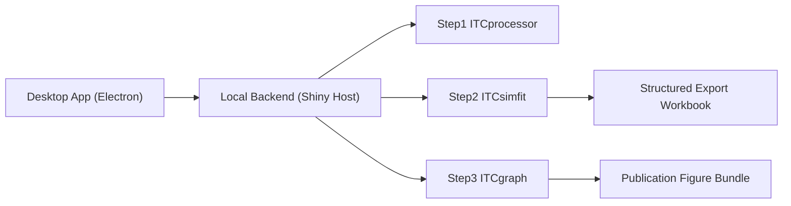

# ITCSuite 对外白皮书（External Whitepaper）

> 品牌说明（Brand Note）  
> 本白皮书中的 `ITCSuite` 指 `ViaBind` 软件系列中的 ITC 套件（`ViaBind_ITCSuite`）。  
> 为便于阅读与技术术语统一，正文保留 `ITCSuite` 的简称写法。

版本：v1.0  
日期：2026-02-21  
文档定位：对外介绍 ITCSuite 的价值、方法可信性与落地方式（非内部实现手册）
声明：本文档由AI自动生成，仅供参考。
---

## 执行摘要（Executive Summary）

ITCSuite 是一套面向等温滴定量热（ITC）场景的端到端分析平台，覆盖原始实验文件处理、模型拟合与出版级图形输出。  
系统采用三步工作流（Step1/Step2/Step3）和桌面化交互设计，目标是在保证科学可解释性的同时，降低数据处理与结果复现门槛。

ITCSuite 的核心价值：

- 模型构建更贴近物理实际：不同于传统固定单模型拟合，ITCSuite 通过“路径组合建模（path-combination modeling）”让用户按体系特征选择反应路径，并快速生成/比较不同模型。
- 拟合策略更稳健：并行提供局部收敛路线（`optim`）与全局搜索路线（`DEoptim`），在效率与跳出 local minima 能力之间提供互补选择。
- 输出更符合科研发表场景：在保证学术表达友好的参数、曲线与诊断输出基础上，保留关键可调自由度（路径、边界、拟合区间、策略），兼顾标准化与灵活性。
- 工程流程更可复现：通过数据契约（data contracts）、结构化导出和测试门禁，支持团队级复查、复跑与协作交接。

---

## 1. 行业痛点与需求（Problem Landscape）

在典型 ITC 分析流程中，研究团队常遇到以下问题：

- 工具链割裂：原始解析、拟合、绘图常分散在不同软件或脚本中。
- 手工转抄风险高：表格来回搬运造成单位、字段、版本不一致。
- 模型透明度不足：结果可视化与拟合过程脱节，难以审阅。
- 团队协作困难：不同成员环境不一致，复现实验分析路径成本高。

ITCSuite 的设计目标是把这些问题收敛为“单流程、单语义、可复查”的工程化分析体验。

---

## 2. 解决方案概览（Solution Overview）

### 2.1 三步科学工作流（Three-Step Scientific Workflow）

1. Step1：原始数据处理（Raw Parsing, Baseline, Integration）  
   输入 `.itc` 或兼容文件，输出清洗后的积分与元数据。
2. Step2：模型模拟与参数拟合（Simulation & Fitting）  
   在参数约束下进行多路径模型拟合，并提供误差与诊断。
3. Step3：出版级图形与交付（Publication Plot & Export）  
   生成论文风格双 Panel 图并导出结构化成果。

### 2.2 平台形态（Deployment Form）

- 本地桌面应用（Electron）+ 本地计算后端（Shiny / R Runtime）
- 支持离线实验环境下的可控运行
- 保持科研数据处理过程在本地设备内闭环

### 2.3 最近导入复用能力（Recent Imports Reuse）

- 系统支持在首页记录当前会话中最近导入的数据文件，便于反复调用与快速续作。
- 覆盖文件类型包括：
  - ITC 源文件（`.itc` / `.txt`）
  - `processed` Excel
  - `fitted` Excel
- 用户可通过一键恢复（Restore）直接回到对应分析步骤，减少重复导入和路径查找成本。

---

## 3. 系统架构（System Architecture）



架构特征：

- 统一宿主（host app）承载三个核心模块，减少上下文切换。
- 模块间通过桥接载荷（bridge payload）传递规范化数据。
- 桌面壳负责后端生命周期、异常恢复与文件选择能力接入。

---

## 4. 核心方法与科学可信性（Methodology & Scientific Credibility）

### 4.1 Step1：数据处理可解释（Data Conditioning with Traceability）

- 对原始文件执行结构化解析（元数据、注射序列、时序功率）。
- 采用分段样条基线（segmented spline baseline）降低漂移影响。
- 采用梯形积分（trapezoidal integration）获取逐针热量。
- 关键参数和中间结果可导出，支持复核与追踪。

### 4.2 Step2：模型驱动拟合（Model-Driven Fitting）

- 相比传统“固定模型拟合”，系统支持按反应路径进行组合建模（path-combination modeling），便于快速构造并比较不同模型假设。
- 采用“解析锚点 + 数值求解”的混合机制平衡稳定性与精度。
- 支持参数修正因子（例如 `fH`, `fG`）在名义空间与真实空间映射。
- 在数值失败场景提供回退策略（fallback）避免流程中断。
- 通过残差与可靠性指标辅助判断拟合质量。

并行提供两类优化路线（dual fitting strategies）：

- 局部收敛路线：常规梯度/局部优化（`optim`），计算高效、适合已有较好初值场景。
- 全局搜索路线：差分进化优化（`DEoptim`），可更好跳出 local minima，提升复杂参数面的探索能力。

### 4.3 Step3：结果表达标准化（Standardized Scientific Presentation）

- 双 Panel 图形结构契合 ITC 论文常见展示习惯。
- 能量单位与标签可配置，保证跨团队表达一致性。
- 可将实验数据与模拟曲线同图叠加，支持对比解释。

---

## 5. 数据契约与互操作（Data Contracts & Interoperability）

ITCSuite 在关键步骤间采用显式 schema 与字段约束，以提升稳定性：

- Step1 -> Step2：`itcsuite.step1.v1`，含 `itcsuite.bundle.v1`
- Step2 -> Step3：`itcsuite.step2_plot.v1`
- 最近记录持久化：`itcsuite.home_recent.v1`

契约化带来的价值：

- 降低“字段漂移”与版本错配风险
- 支持模块独立演化而不破坏跨步集成
- 便于后续对接 LIMS、自动化流水线或审计系统

---

## 6. 质量保障与可复现性（Quality Assurance & Reproducibility）

ITCSuite 采用分层测试门禁（test gate）：

- `unit`：函数与逻辑单元验证
- `smoke`：应用启动与桥接冒烟验证
- `golden`：关键输出的回归一致性验证

标准执行入口：

```bash
Rscript tests/run_all.R --strict
```

该机制用于确保版本迭代下分析结果的稳定性与可比较性。

---

## 7. 安全与运行治理（Security & Operational Governance）

### 7.1 本地优先（Local-First）

- 数据处理可在本地完成，减少外部传输路径。
- 适合对数据主权与保密要求较高的科研场景。

### 7.2 运行容错（Runtime Resilience）

- 桌面壳具备后端就绪握手与错误上报机制。
- 面向休眠恢复、渲染无响应等场景提供恢复策略。

### 7.3 可审计输出（Auditable Outputs）

- 结构化导出（多 sheet 语义化）支持结果追溯。
- 模型参数、修订数据、诊断结果可关联存档。

---

## 8. 典型应用场景（Representative Use Cases）

- 学术研究团队  
  从原始 ITC 数据到论文图产出的一站式流程，减少多工具切换。
- 企业研发团队  
  在项目周期内标准化分析步骤，降低人员更替导致的流程偏差。
- 共享平台与合作课题  
  通过统一导出结构和门禁测试提升跨团队结果可比性。

---

## 9. 对用户与组织的价值（Value to Stakeholders）

对研究人员：

- 更快完成从实验到结论图表的闭环。
- 更容易解释拟合过程与参数来源。
- 可根据路径组合快速生成不同模型并对比，而非被固定模型约束。
- 可从“最近导入”列表快速重复调用 ITC/processed/fitted 文件，持续迭代分析更顺畅。

对团队负责人：

- 更易建立标准化 SOP（Standard Operating Procedure）。
- 更可控地进行版本管理与结果复查。
- 既可采用统一默认流程，也保留用户可调空间以适配不同课题。

对组织层面：

- 降低重复劳动与返工成本。
- 提高数据资产沉淀质量和可传承性。

---

## 10. 采用路径建议（Adoption Path）

1. 小规模试点  
   选择 1-2 个历史数据集完成全流程复跑。
2. 建立团队模板  
   固定导出规范、命名规则与评审口径。
3. 接入质量门禁  
   将 `--strict` 测试纳入发布前检查。
4. 形成持续迭代机制  
   基于反馈更新参数边界、图形模板和协作规范。

---

## 11. 当前边界与未来方向（Current Boundaries & Roadmap）

当前边界：

- 本白皮书聚焦 ITCSuite 当前已落地能力，不扩展未实现功能承诺。
- 结果解释仍依赖领域专家判断，工具不替代科学结论本身。

未来方向（示意）：

- 更丰富的模型家族与诊断可视化
- 更强的批量任务与流程自动化能力
- 更完善的跨系统接口（如实验记录系统/LIMS）

---

## 12. 结语（Conclusion）

ITCSuite 的核心不是单一算法，而是把“科学分析可信性”与“工程化可复现性”结合为一个可执行系统。  
对于希望提升 ITC 数据处理效率、质量和协作一致性的团队，ITCSuite 提供了可落地的统一工作流基础。
其关键方法论是：以路径组合建模贴近物理实际，以“局部 + 全局”双优化路线兼顾效率与稳健，并以学术发表友好的输出形态结合用户可调整自由度。

---

## 附：术语速览（Quick Glossary）

| 术语 | 英文 | 简述 |
|---|---|---|
| 基线校正 | Baseline Correction | 去除信号漂移与背景影响 |
| 梯形积分 | Trapezoidal Integration | 逐针热量面积近似计算 |
| 桥接载荷 | Bridge Payload | 步骤间传递的数据对象 |
| 表观比值 | Apparent Ratio | 用于展示与比较的比例空间 |
| 回退求解 | Fallback Solve | 数值求解失败时的保底路径 |
